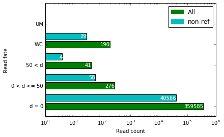
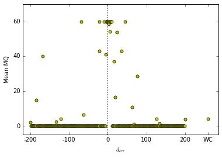
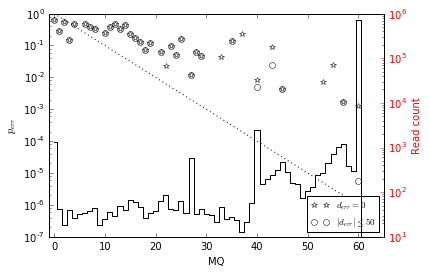
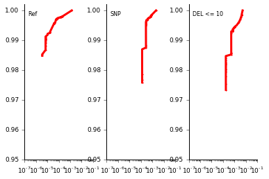

### This tutorial takes you through the basics of analysing Mitty data with some help from cytoolz and pandas


```python
%load_ext autoreload
%autoreload 2
```


```python
import time
import matplotlib.pyplot as plt
import cytoolz.curried as cyt
```


```python
import mitty.analysis.bam as mab
import mitty.analysis.plots as mapl
```


```python
fname = '../alignment-accuracy/HG00119-bwa.bam'
scar_fname = '../generating-reads/HG00119-reads-corrupt-lq.txt'
```

Ex1
---
Simple example showing reading from a BAM and writing out to another BAM

1. Reading from a BAM
2. Write out to another BAM


```python
r1 = mab.read_bam(bam_fname=fname, sidecar_fname=None)
r2 = mab.write_bam('eraseme.bam', mab.get_header(fname))

for r in cyt.pipe(r1, r2, cyt.take(20)):
    pass
```

Ex2
---
More involved example showing, in sequence:

1. Reading from a BAM
2. Compute d_err for the reads
3. Categorize reads based on d_err
4. Count reads in each category
5. Pairing up of reads
6. Filter to keep non-reference reads only. Keep a pair only if both reads are non-ref
7. Re-Categorize reads based on d_err
8. Re-Count reads in each category

At the end the category counts are comparatively plotted.


```python
r1 = mab.read_bam(bam_fname=fname, sidecar_fname=scar_fname)
r2 = mab.compute_derr(max_d=200)

f_dict = {
    'd = 0': lambda mate: mate['d_err'] == 0,
    '0 < d <= 50': lambda mate: 0 < mate['d_err'] <= 50,
    '50 < d': lambda mate: 50 < mate['d_err'] < 200,
    'WC': lambda mate: 200 < mate['d_err'],
    'UM': lambda mate: mate['read'].is_unmapped
}
r3 = mab.categorize_reads(f_dict)
all_counts = {}
r4 = mab.count_reads(all_counts) 
r5 = mab.make_pairs
r6 = mab.filter_reads(mab.non_ref(), all)
r7 = mab.categorize_reads(f_dict)
nr_counts = {}
r8 = mab.count_reads(nr_counts)

for r in cyt.pipe(r1, r2, r3, r4, r5, r6, r7, r8):
    pass
```

The new concept here is the use of a dictionary of filters to supply to the categorization function. The result is stored in the `all_counts` and `nr_counts` dictionaries which need to be preallocated and passed to the counting function which modifes them.


```python
mapl.plot_read_counts(ax=plt.subplot(1, 1, 1), 
                      counts_l=[all_counts, nr_counts],
                      labels=['All', 'non-ref'],
                      keys=['d = 0', '0 < d <= 50', '50 < d', 'WC', 'UM'], 
                      colors=None)
plt.show()
```





Ex3
---
Alignment metrics plotting example

1. Read BAMs
2. Compute d_err
3. Create 3D alignment histogram based on alignment metrics of the reads


```python
r1 = mab.read_bam(bam_fname=fname, sidecar_fname=scar_fname)
r2 = mab.compute_derr(max_d=200)
dmv_mat = mab.zero_dmv(max_d=200, max_MQ=70, max_vlen=200)
r3 = mab.alignment_hist(dmv_mat)

mab.simple_sink(cyt.pipe(r1, r2, r3))
```


```python
ax = plt.subplot(1,1,1)
mapl.plot_mean_MQ_vs_derr(ax=ax, dmv_mat=dmv_mat, fmt='yo', ms=5)
plt.show()
```





```python
ax1 = plt.subplot(1,1,1)
mapl.plot_perr_vs_MQ(ax=ax1, dmv_mat=dmv_mat, yscale='log')
ax2 = ax1.twinx()
mapl.plot_read_count_vs_MQ(ax=ax2, dmv_mat=dmv_mat)
ax2.set_ylabel('Read count', color='r')
ax2.tick_params('y', colors='r')
ax1.legend(loc='lower right', fontsize=9)
plt.show()
```





```python
for n, v_bin_label in enumerate(
    ['Ref', 'SNP', 'DEL <= 10']):
    ax = plt.subplot(1, 3, n + 1)
    mapl.hengli_plot(ax=ax, dmv_mat=dmv_mat, v_bin_label=v_bin_label)
plt.show()
```





Ex4: Dataframes
--------------


```python
r1 = mab.read_bam(bam_fname=fname, sidecar_fname=scar_fname)
r2 = mab.compute_derr(max_d=200)
r3 = mab.to_df(tags=['NM'])
df = cyt.pipe(r1, r2, cyt.take(20), r3)
df
```


<div>
<table border="1" class="dataframe">
  <thead>
    <tr style="text-align: right;">
      <th></th>
      <th>qname</th>
      <th>mate</th>
      <th>chrom</th>
      <th>pos</th>
      <th>cigar</th>
      <th>MQ</th>
      <th>d_err</th>
      <th>correct_chrom</th>
      <th>correct_pos</th>
      <th>correct_cigar</th>
      <th>NM</th>
    </tr>
  </thead>
  <tbody>
    <tr>
      <th>0</th>
      <td>3E78</td>
      <td>2</td>
      <td>1</td>
      <td>13655999</td>
      <td>148M102S</td>
      <td>0</td>
      <td>201</td>
      <td>20</td>
      <td>2805905</td>
      <td>250=</td>
      <td>13</td>
    </tr>
    <tr>
      <th>1</th>
      <td>3E78</td>
      <td>1</td>
      <td>1</td>
      <td>13656153</td>
      <td>250M</td>
      <td>0</td>
      <td>201</td>
      <td>20</td>
      <td>2806059</td>
      <td>250=</td>
      <td>13</td>
    </tr>
    <tr>
      <th>2</th>
      <td>V91</td>
      <td>2</td>
      <td>1</td>
      <td>25159291</td>
      <td>155M95S</td>
      <td>0</td>
      <td>201</td>
      <td>20</td>
      <td>2805632</td>
      <td>250=</td>
      <td>13</td>
    </tr>
    <tr>
      <th>3</th>
      <td>V91</td>
      <td>1</td>
      <td>1</td>
      <td>25159312</td>
      <td>21S229M</td>
      <td>0</td>
      <td>201</td>
      <td>20</td>
      <td>2805632</td>
      <td>250=</td>
      <td>13</td>
    </tr>
    <tr>
      <th>4</th>
      <td>OMF</td>
      <td>1</td>
      <td>1</td>
      <td>83806363</td>
      <td>230M20S</td>
      <td>1</td>
      <td>201</td>
      <td>20</td>
      <td>1723777</td>
      <td>250=</td>
      <td>13</td>
    </tr>
    <tr>
      <th>5</th>
      <td>OMF</td>
      <td>2</td>
      <td>1</td>
      <td>83806654</td>
      <td>117S133M</td>
      <td>1</td>
      <td>201</td>
      <td>20</td>
      <td>1723603</td>
      <td>250=</td>
      <td>13</td>
    </tr>
    <tr>
      <th>6</th>
      <td>1MX7</td>
      <td>2</td>
      <td>1</td>
      <td>90213017</td>
      <td>142M108S</td>
      <td>13</td>
      <td>201</td>
      <td>20</td>
      <td>1724998</td>
      <td>250=</td>
      <td>13</td>
    </tr>
    <tr>
      <th>7</th>
      <td>1MX7</td>
      <td>1</td>
      <td>1</td>
      <td>90213096</td>
      <td>15S235M</td>
      <td>13</td>
      <td>201</td>
      <td>20</td>
      <td>1724934</td>
      <td>250=</td>
      <td>13</td>
    </tr>
    <tr>
      <th>8</th>
      <td>1I52</td>
      <td>2</td>
      <td>1</td>
      <td>161392686</td>
      <td>174M76S</td>
      <td>18</td>
      <td>201</td>
      <td>20</td>
      <td>2999958</td>
      <td>250=</td>
      <td>13</td>
    </tr>
    <tr>
      <th>9</th>
      <td>23Z8</td>
      <td>1</td>
      <td>1</td>
      <td>164432660</td>
      <td>222M28S</td>
      <td>12</td>
      <td>201</td>
      <td>20</td>
      <td>1723850</td>
      <td>250=</td>
      <td>13</td>
    </tr>
    <tr>
      <th>10</th>
      <td>23Z8</td>
      <td>2</td>
      <td>1</td>
      <td>164432903</td>
      <td>130S120M</td>
      <td>12</td>
      <td>201</td>
      <td>20</td>
      <td>1723963</td>
      <td>250=</td>
      <td>13</td>
    </tr>
    <tr>
      <th>11</th>
      <td>31U4</td>
      <td>2</td>
      <td>1</td>
      <td>171659447</td>
      <td>166M84S</td>
      <td>0</td>
      <td>201</td>
      <td>20</td>
      <td>1723954</td>
      <td>250=</td>
      <td>13</td>
    </tr>
    <tr>
      <th>12</th>
      <td>31U4</td>
      <td>1</td>
      <td>1</td>
      <td>171659566</td>
      <td>24S226M</td>
      <td>0</td>
      <td>201</td>
      <td>20</td>
      <td>1723859</td>
      <td>250=</td>
      <td>13</td>
    </tr>
    <tr>
      <th>13</th>
      <td>2XAL</td>
      <td>1</td>
      <td>1</td>
      <td>195896134</td>
      <td>250M</td>
      <td>0</td>
      <td>201</td>
      <td>20</td>
      <td>1723416</td>
      <td>250=</td>
      <td>13</td>
    </tr>
    <tr>
      <th>14</th>
      <td>2XAL</td>
      <td>2</td>
      <td>1</td>
      <td>195896317</td>
      <td>106S144M</td>
      <td>0</td>
      <td>201</td>
      <td>20</td>
      <td>1723339</td>
      <td>250=</td>
      <td>13</td>
    </tr>
    <tr>
      <th>15</th>
      <td>3NDP</td>
      <td>2</td>
      <td>1</td>
      <td>196190464</td>
      <td>169M81S</td>
      <td>6</td>
      <td>201</td>
      <td>20</td>
      <td>1723466</td>
      <td>250=</td>
      <td>13</td>
    </tr>
    <tr>
      <th>16</th>
      <td>3NDP</td>
      <td>1</td>
      <td>1</td>
      <td>196190500</td>
      <td>24S226M</td>
      <td>6</td>
      <td>201</td>
      <td>20</td>
      <td>1723454</td>
      <td>250=</td>
      <td>13</td>
    </tr>
    <tr>
      <th>17</th>
      <td>19DY</td>
      <td>1</td>
      <td>1</td>
      <td>212471810</td>
      <td>244M6S</td>
      <td>0</td>
      <td>201</td>
      <td>20</td>
      <td>2805505</td>
      <td>250=</td>
      <td>13</td>
    </tr>
    <tr>
      <th>18</th>
      <td>19DY</td>
      <td>2</td>
      <td>1</td>
      <td>212471920</td>
      <td>110S140M</td>
      <td>0</td>
      <td>201</td>
      <td>20</td>
      <td>2805505</td>
      <td>250=</td>
      <td>13</td>
    </tr>
    <tr>
      <th>19</th>
      <td>ET1</td>
      <td>2</td>
      <td>1</td>
      <td>213023234</td>
      <td>159M91S</td>
      <td>0</td>
      <td>201</td>
      <td>20</td>
      <td>1723777</td>
      <td>250=</td>
      <td>13</td>
    </tr>
  </tbody>
</table>
</div>


```python
r1 = mab.read_bam(bam_fname=fname, sidecar_fname=scar_fname)
r2 = mab.compute_derr(max_d=200)
r3 = mab.make_pairs
r4 = mab.to_df(tags=['NM'])
df = cyt.pipe(r1, r2, r3, cyt.take(20), r4)
df
```


<div>
<table border="1" class="dataframe">
  <thead>
    <tr>
      <th></th>
      <th>qname</th>
      <th colspan="9" halign="left">mate1</th>
      <th>...</th>
      <th colspan="10" halign="left">mate2</th>
    </tr>
    <tr>
      <th></th>
      <th>NaN</th>
      <th>mate</th>
      <th>chrom</th>
      <th>pos</th>
      <th>cigar</th>
      <th>MQ</th>
      <th>d_err</th>
      <th>correct_chrom</th>
      <th>correct_pos</th>
      <th>correct_cigar</th>
      <th>...</th>
      <th>mate</th>
      <th>chrom</th>
      <th>pos</th>
      <th>cigar</th>
      <th>MQ</th>
      <th>d_err</th>
      <th>correct_chrom</th>
      <th>correct_pos</th>
      <th>correct_cigar</th>
      <th>NM</th>
    </tr>
  </thead>
  <tbody>
    <tr>
      <th>0</th>
      <td>3E78</td>
      <td>1</td>
      <td>1</td>
      <td>13656153</td>
      <td>250M</td>
      <td>0</td>
      <td>201</td>
      <td>20</td>
      <td>2806059</td>
      <td>250=</td>
      <td>...</td>
      <td>2</td>
      <td>1</td>
      <td>13655999</td>
      <td>148M102S</td>
      <td>0</td>
      <td>201</td>
      <td>20</td>
      <td>2805905</td>
      <td>250=</td>
      <td>12</td>
    </tr>
    <tr>
      <th>1</th>
      <td>V91</td>
      <td>1</td>
      <td>1</td>
      <td>25159312</td>
      <td>21S229M</td>
      <td>0</td>
      <td>201</td>
      <td>20</td>
      <td>2805632</td>
      <td>250=</td>
      <td>...</td>
      <td>2</td>
      <td>1</td>
      <td>25159291</td>
      <td>155M95S</td>
      <td>0</td>
      <td>201</td>
      <td>20</td>
      <td>2805632</td>
      <td>250=</td>
      <td>12</td>
    </tr>
    <tr>
      <th>2</th>
      <td>OMF</td>
      <td>1</td>
      <td>1</td>
      <td>83806363</td>
      <td>230M20S</td>
      <td>1</td>
      <td>201</td>
      <td>20</td>
      <td>1723777</td>
      <td>250=</td>
      <td>...</td>
      <td>2</td>
      <td>1</td>
      <td>83806654</td>
      <td>117S133M</td>
      <td>1</td>
      <td>201</td>
      <td>20</td>
      <td>1723603</td>
      <td>250=</td>
      <td>12</td>
    </tr>
    <tr>
      <th>3</th>
      <td>1MX7</td>
      <td>1</td>
      <td>1</td>
      <td>90213096</td>
      <td>15S235M</td>
      <td>13</td>
      <td>201</td>
      <td>20</td>
      <td>1724934</td>
      <td>250=</td>
      <td>...</td>
      <td>2</td>
      <td>1</td>
      <td>90213017</td>
      <td>142M108S</td>
      <td>13</td>
      <td>201</td>
      <td>20</td>
      <td>1724998</td>
      <td>250=</td>
      <td>12</td>
    </tr>
    <tr>
      <th>4</th>
      <td>23Z8</td>
      <td>1</td>
      <td>1</td>
      <td>164432660</td>
      <td>222M28S</td>
      <td>12</td>
      <td>201</td>
      <td>20</td>
      <td>1723850</td>
      <td>250=</td>
      <td>...</td>
      <td>2</td>
      <td>1</td>
      <td>164432903</td>
      <td>130S120M</td>
      <td>12</td>
      <td>201</td>
      <td>20</td>
      <td>1723963</td>
      <td>250=</td>
      <td>12</td>
    </tr>
    <tr>
      <th>5</th>
      <td>31U4</td>
      <td>1</td>
      <td>1</td>
      <td>171659566</td>
      <td>24S226M</td>
      <td>0</td>
      <td>201</td>
      <td>20</td>
      <td>1723859</td>
      <td>250=</td>
      <td>...</td>
      <td>2</td>
      <td>1</td>
      <td>171659447</td>
      <td>166M84S</td>
      <td>0</td>
      <td>201</td>
      <td>20</td>
      <td>1723954</td>
      <td>250=</td>
      <td>12</td>
    </tr>
    <tr>
      <th>6</th>
      <td>2XAL</td>
      <td>1</td>
      <td>1</td>
      <td>195896134</td>
      <td>250M</td>
      <td>0</td>
      <td>201</td>
      <td>20</td>
      <td>1723416</td>
      <td>250=</td>
      <td>...</td>
      <td>2</td>
      <td>1</td>
      <td>195896317</td>
      <td>106S144M</td>
      <td>0</td>
      <td>201</td>
      <td>20</td>
      <td>1723339</td>
      <td>250=</td>
      <td>12</td>
    </tr>
    <tr>
      <th>7</th>
      <td>3NDP</td>
      <td>1</td>
      <td>1</td>
      <td>196190500</td>
      <td>24S226M</td>
      <td>6</td>
      <td>201</td>
      <td>20</td>
      <td>1723454</td>
      <td>250=</td>
      <td>...</td>
      <td>2</td>
      <td>1</td>
      <td>196190464</td>
      <td>169M81S</td>
      <td>6</td>
      <td>201</td>
      <td>20</td>
      <td>1723466</td>
      <td>250=</td>
      <td>12</td>
    </tr>
    <tr>
      <th>8</th>
      <td>19DY</td>
      <td>1</td>
      <td>1</td>
      <td>212471810</td>
      <td>244M6S</td>
      <td>0</td>
      <td>201</td>
      <td>20</td>
      <td>2805505</td>
      <td>250=</td>
      <td>...</td>
      <td>2</td>
      <td>1</td>
      <td>212471920</td>
      <td>110S140M</td>
      <td>0</td>
      <td>201</td>
      <td>20</td>
      <td>2805505</td>
      <td>250=</td>
      <td>12</td>
    </tr>
    <tr>
      <th>9</th>
      <td>ET1</td>
      <td>1</td>
      <td>1</td>
      <td>213023701</td>
      <td>12S238M</td>
      <td>0</td>
      <td>201</td>
      <td>20</td>
      <td>1723322</td>
      <td>250=</td>
      <td>...</td>
      <td>2</td>
      <td>1</td>
      <td>213023234</td>
      <td>159M91S</td>
      <td>0</td>
      <td>201</td>
      <td>20</td>
      <td>1723777</td>
      <td>250=</td>
      <td>12</td>
    </tr>
    <tr>
      <th>10</th>
      <td>NAH</td>
      <td>1</td>
      <td>1</td>
      <td>244686794</td>
      <td>225M25S</td>
      <td>0</td>
      <td>201</td>
      <td>20</td>
      <td>3479486</td>
      <td>250=</td>
      <td>...</td>
      <td>2</td>
      <td>1</td>
      <td>244686886</td>
      <td>92S158M</td>
      <td>0</td>
      <td>201</td>
      <td>20</td>
      <td>3479486</td>
      <td>250=</td>
      <td>12</td>
    </tr>
    <tr>
      <th>11</th>
      <td>I8D</td>
      <td>1</td>
      <td>2</td>
      <td>14992152</td>
      <td>250M</td>
      <td>0</td>
      <td>201</td>
      <td>20</td>
      <td>3479428</td>
      <td>250=</td>
      <td>...</td>
      <td>2</td>
      <td>2</td>
      <td>14992155</td>
      <td>3S169M78S</td>
      <td>0</td>
      <td>201</td>
      <td>20</td>
      <td>3479428</td>
      <td>250=</td>
      <td>12</td>
    </tr>
    <tr>
      <th>12</th>
      <td>298B</td>
      <td>1</td>
      <td>2</td>
      <td>66343926</td>
      <td>141M1I106M2S</td>
      <td>1</td>
      <td>201</td>
      <td>20</td>
      <td>1725120</td>
      <td>250=</td>
      <td>...</td>
      <td>2</td>
      <td>2</td>
      <td>66344097</td>
      <td>94S156M</td>
      <td>1</td>
      <td>201</td>
      <td>20</td>
      <td>1725042</td>
      <td>250=</td>
      <td>12</td>
    </tr>
    <tr>
      <th>13</th>
      <td>3CA5</td>
      <td>1</td>
      <td>2</td>
      <td>173183389</td>
      <td>233M17S</td>
      <td>14</td>
      <td>201</td>
      <td>20</td>
      <td>1723043</td>
      <td>59=1X9=1X13=1X166=</td>
      <td>...</td>
      <td>2</td>
      <td>2</td>
      <td>173183577</td>
      <td>98S147M5S</td>
      <td>14</td>
      <td>201</td>
      <td>20</td>
      <td>1723133</td>
      <td>250=</td>
      <td>12</td>
    </tr>
    <tr>
      <th>14</th>
      <td>394F</td>
      <td>1</td>
      <td>2</td>
      <td>198554598</td>
      <td>235M15S</td>
      <td>0</td>
      <td>201</td>
      <td>20</td>
      <td>1723089</td>
      <td>13=1X9=1X13=1X212=</td>
      <td>...</td>
      <td>2</td>
      <td>2</td>
      <td>198554865</td>
      <td>105S141M4S</td>
      <td>0</td>
      <td>201</td>
      <td>20</td>
      <td>1722927</td>
      <td>175=1X9=1X13=1X50=</td>
      <td>12</td>
    </tr>
    <tr>
      <th>15</th>
      <td>21FN</td>
      <td>1</td>
      <td>2</td>
      <td>223016822</td>
      <td>250M</td>
      <td>0</td>
      <td>201</td>
      <td>20</td>
      <td>1722928</td>
      <td>174=1X9=1X13=1X51=</td>
      <td>...</td>
      <td>2</td>
      <td>2</td>
      <td>223016733</td>
      <td>138M112S</td>
      <td>0</td>
      <td>201</td>
      <td>20</td>
      <td>1723017</td>
      <td>85=1X9=1X13=1X140=</td>
      <td>12</td>
    </tr>
    <tr>
      <th>16</th>
      <td>G2N</td>
      <td>1</td>
      <td>3</td>
      <td>67865157</td>
      <td>1S249M</td>
      <td>0</td>
      <td>201</td>
      <td>20</td>
      <td>1724987</td>
      <td>250=</td>
      <td>...</td>
      <td>2</td>
      <td>3</td>
      <td>67864864</td>
      <td>153M97S</td>
      <td>0</td>
      <td>201</td>
      <td>20</td>
      <td>1725279</td>
      <td>250=</td>
      <td>12</td>
    </tr>
    <tr>
      <th>17</th>
      <td>2254</td>
      <td>1</td>
      <td>3</td>
      <td>103277760</td>
      <td>26S224M</td>
      <td>0</td>
      <td>201</td>
      <td>20</td>
      <td>1723077</td>
      <td>25=1X9=1X13=1X200=</td>
      <td>...</td>
      <td>2</td>
      <td>3</td>
      <td>103277593</td>
      <td>131M119S</td>
      <td>0</td>
      <td>201</td>
      <td>20</td>
      <td>1723218</td>
      <td>250=</td>
      <td>12</td>
    </tr>
    <tr>
      <th>18</th>
      <td>AVB</td>
      <td>1</td>
      <td>3</td>
      <td>152151311</td>
      <td>228M22S</td>
      <td>25</td>
      <td>201</td>
      <td>20</td>
      <td>1615462</td>
      <td>82=1X10=1X37=1X67=1X50=</td>
      <td>...</td>
      <td>2</td>
      <td>3</td>
      <td>152151409</td>
      <td>98S143M9S</td>
      <td>25</td>
      <td>201</td>
      <td>20</td>
      <td>1615462</td>
      <td>82=1X10=1X37=1X67=1X50=</td>
      <td>12</td>
    </tr>
    <tr>
      <th>19</th>
      <td>K1Y</td>
      <td>1</td>
      <td>3</td>
      <td>152953832</td>
      <td>231M19S</td>
      <td>2</td>
      <td>201</td>
      <td>20</td>
      <td>3774532</td>
      <td>250=</td>
      <td>...</td>
      <td>2</td>
      <td>3</td>
      <td>152954145</td>
      <td>80S170M</td>
      <td>2</td>
      <td>201</td>
      <td>20</td>
      <td>3774765</td>
      <td>97=1X152=</td>
      <td>12</td>
    </tr>
  </tbody>
</table>
<p>20 rows × 21 columns</p>
</div>


```python

```
